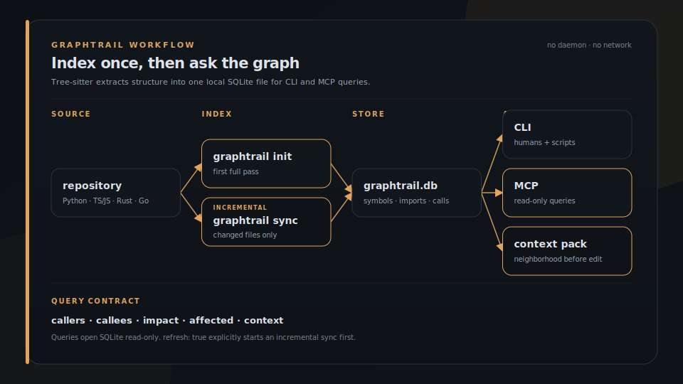

<p align="center">
  
</p>

<h1 align="center">GraphTrail</h1>

<p align="center">
  <strong>A local code-graph sidecar that maps your repo into a SQLite graph of symbols, imports, and call edges, then answers callers, callees, impact, and context over a CLI and a read-only MCP server. It is what your AI agent reads before it edits, so a change starts with the call graph instead of a guess. Unlike a grep or an embedding index, it walks real tree-sitter call edges, stays read-only, and runs with no daemon and no network.</strong>
</p>

<p align="center">
  <a href="https://graphtrail.escoffierlabs.dev"><strong>Website &rarr; graphtrail.escoffierlabs.dev</strong></a>
</p>

<p align="center">
  
  
  
  
</p>

GraphTrail indexes your code once, stays incremental after that, and answers structural questions before an agent touches a line.

<p align="center">
  
</p>

Index a repo, then ask who calls a symbol and what context an agent should load before editing it. The `context` pack is exactly what an agent gets over MCP.

## What it does

GraphTrail is a code-graph navigation tool for AI coding agents and developers. It parses each source file with tree-sitter in a single pass, extracts symbols (functions, classes, methods), imports, and call edges, and writes them into a small local SQLite graph under `.graphtrail/`. From that graph it answers the structural questions you ask before changing code: full-text symbol search, the callers of a symbol, its callees, the impact (blast radius) of a change, and a context pack that gathers entry points plus their caller and callee neighborhood for a task.

It speaks two surfaces over the same graph. A command-line interface for humans and scripts, and a read-only Model Context Protocol (MCP) server (`graphtrail-mcp`) that exposes the same queries as tools an agent can call. The MCP server opens every connection `SQLITE_OPEN_READ_ONLY`, so it can never mutate your graph, and it is multi-repo: one running server can answer for any repository you have indexed. It supports Python, TypeScript/JavaScript, Rust, and Go. After indexing it is read-only, installs no hooks, starts no daemon, and makes no network calls.

## Install

GraphTrail is a Rust crate with two binaries: `graphtrail` (the CLI) and `graphtrail-mcp` (the MCP server). Install both with cargo:

```bash
cargo install --git https://github.com/escoffier-labs/graphtrail
```

Or build from a clone:

```bash
git clone https://github.com/escoffier-labs/graphtrail.git
cd graphtrail
cargo build --release   # binaries land in target/release/
```

## Quickstart

Index a repository, then ask the graph structural questions:

```bash
# Index once, then keep it current incrementally.
graphtrail init /path/to/repo
graphtrail sync /path/to/repo          # incremental: a no-op when nothing changed
graphtrail sync /path/to/repo --force  # rebuild every file

# Query against the repo's graph database.
DB=/path/to/repo/.graphtrail/graphtrail.db
graphtrail --db "$DB" search "handoff lint"
graphtrail --db "$DB" callers serve
graphtrail --db "$DB" callees serve
graphtrail --db "$DB" impact serve
graphtrail --db "$DB" context "handoff lint" --json
graphtrail --db "$DB" stats --json
```

A real `callers` query against GraphTrail's own indexed source:

```text
$ graphtrail --db .graphtrail/graphtrail.db callers serve
main --calls@19--> serve  (src/bin/graphtrail-mcp.rs -> src/mcp.rs)
```

## MCP server

`graphtrail-mcp` is a read-only MCP server that speaks newline-delimited JSON-RPC 2.0 over stdio. It has no async runtime and no extra dependencies, so the sidecar stays small. The default database comes from `--db <path>`, `--db=<path>`, the `GRAPHTRAIL_DB` env var, or `.graphtrail/graphtrail.db` in the working directory. Every tool also accepts an optional `repo` (uses `<repo>/.graphtrail/graphtrail.db`) or `db` (explicit path) argument, so a single running server can answer for any indexed repository. The database is opened lazily per call, so the server starts even before the default db exists.

Register it with an MCP client. For Claude Code, add to `.mcp.json` (project scope) or `~/.claude.json` (user scope):

```json
{
  "mcpServers": {
    "graphtrail": {
      "command": "/abs/path/to/graphtrail-mcp",
      "args": ["--db", "/abs/path/to/repo/.graphtrail/graphtrail.db"]
    }
  }
}
```

### Tools

The server exposes eight tools, every one read-only. This list is verified against the live `tools/list` response from `graphtrail-mcp`:

| Tool | Required args | What it returns |
|---|---|---|
| `search` | `query` (`limit` optional, default 20, `path` optional) | Full-text search of code symbols (functions, classes, methods) by name, optionally filtered by indexed file path. |
| `callers` | `symbol` | Symbols that call the given symbol (incoming call edges). |
| `callees` | `symbol` | Symbols called by the given symbol (outgoing call edges). |
| `impact` | `symbol` | Combined callers and callees of a symbol (the blast radius of a change). |
| `context` | `task` (`limit` optional, default 12) | A context pack: matching entry points plus their caller/callee neighborhood and related files. |
| `stats` | none | Counts of files, symbols, edges, imports, schema version, sync metadata, and per-language file counts. |
| `file_neighbors` | `path` | Files connected to an indexed file by incoming or outgoing call edges. |
| `repos` | none (`roots` optional) | Default database metadata plus optional one-level scans for `.graphtrail/graphtrail.db` under root directories. |

Every tool additionally accepts an optional `repo` or `db` selector for multi-repo use.

A real `stats` tool call (the server indexed GraphTrail's own source first):

```json
{
  "edges": 168,
  "files": 26,
  "imports": 119,
  "language_files": {
    "go": 1,
    "python": 3,
    "rust": 18,
    "typescript": 4
  },
  "schema_version": 2,
  "symbols": 150,
  "synced_at": "1783099401",
  "tool_version": "0.1.0"
}
```

## Optional integrations

GraphTrail's Brigade adapter is built in: `graphtrail context "<task>" --markdown` renders a context pack as a Brigade-friendly markdown document you can drop into a handoff's evidence section.

Two more adapters are gated behind optional cargo features, so the default binary stays free of network and cross-tool dependencies:

```bash
# Blend Code Search embedding hits with graph centrality.
# Honors CODE_SEARCH_URL and CODE_SEARCH_API_KEY.
cargo run --features codesearch -- --db <db> blend "rate limiting" --json

# Surface MiseLedger evidence items (read-only FTS) mentioning a symbol or term.
# Honors MISELEDGER_DB (defaults to ~/.local/share/miseledger/miseledger.db).
cargo run --features miseledger -- links "dispatch" --json
```

## How the pieces fit

GraphTrail is one station in a small set of focused tools:

- **Code Search** keeps semantic chunks, summaries, and embeddings.
- **GraphTrail** owns symbols, imports, call edges, and graph context.
- **MiseLedger** owns session and evidence archives and JSON receipts.
- **Brigade** owns operator workflow, handoffs, context packs, and guardrails.

Internally the code is split into focused modules: `model` (shared types), `extractors` (per-language tree-sitter providers plus traversal), `store` (`db`, `schema`, `sync`), `query` (`search`, `graph`, `context`, `stats`), and a thin `cli`.

## Why not just grep or an embedding index?

- **grep / ripgrep** find text, not structure. They will show you every line where a name appears, but they do not know that one function calls another, so they cannot answer "who calls this" or "what breaks if I change it." GraphTrail walks real tree-sitter call edges and answers those directly.
- **An embedding / semantic index** (the kind Code Search keeps) is great for "find code that looks relevant to this idea," but it ranks by similarity, not by reachability. It will not tell you the blast radius of an edit. GraphTrail is the structural layer; the two compose, which is exactly what the optional `blend` feature does.
- **A language server (LSP)** gives precise per-language navigation inside an editor, but it is a stateful daemon tied to one project and one process, not a queryable database an agent can hit over MCP across many repos at once. GraphTrail persists a small graph to disk, stays read-only, runs no daemon, and is multi-repo from a single server.
- **A full code-intelligence platform** (graph databases, ctags servers, hosted indexers) does far more and costs far more to run. GraphTrail is a sidecar on purpose: one SQLite file per repo, no network, no background process.

## What GraphTrail is not

GraphTrail is a sidecar, not a platform. It does not:

- run a daemon, install hooks, or watch your filesystem
- make network calls in the default build
- own memory, receipts, publishing, or scheduling (those stay in Brigade and MiseLedger)
- keep semantic chunks, summaries, or embeddings (Code Search owns those)
- mutate your code or your graph after indexing (the MCP server is read-only by construction)

It indexes source into a graph and answers structural questions. That is the whole job.

## Contributing

Issues and pull requests are welcome. See [CONTRIBUTING.md](CONTRIBUTING.md) for local dev setup and what lands easily, [SECURITY.md](SECURITY.md) for reporting vulnerabilities privately, and [CODE_OF_CONDUCT.md](CODE_OF_CONDUCT.md). GraphTrail is MIT licensed; see [LICENSE](LICENSE).
