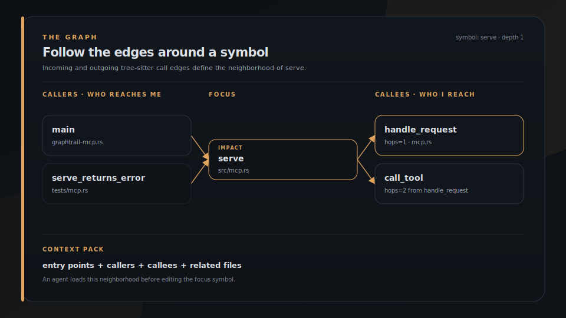

<p align="center">
  
</p>

<h1 align="center">GraphTrail</h1>

<p align="center">
  
</p>

<p align="center">
  <strong>Your agents grep. GraphTrail shows who calls whom.</strong>
</p>

<p align="center">
  Local code graph in SQLite: symbols, imports, and real tree-sitter call edges. Ask <code>callers</code>, <code>callees</code>, <code>impact</code>, and <code>context</code> over a CLI or a read-only MCP server, so an edit starts from the call graph instead of a guess. No daemon, no network in the default build.
</p>

<p align="center">
  <a href="https://brigade.tools/graphtrail">Website</a> &middot;
  <a href="#install">Install</a> &middot;
  <a href="https://brigade.tools">Brigade hub</a>
</p>

<p align="center">
  
  
  
  
</p>

## Install

Two binaries: `graphtrail` (CLI) and `graphtrail-mcp` (read-only MCP). From [crates.io](https://crates.io/crates/graphtrail):

```bash
cargo install graphtrail
```

From git or a clone:

```bash
cargo install --git https://github.com/escoffier-labs/graphtrail
# or
git clone https://github.com/escoffier-labs/graphtrail.git
cd graphtrail && cargo build --release
```

## Quickstart

```bash
graphtrail init .
graphtrail sync .                    # incremental after the first pass
DB=.graphtrail/graphtrail.db

graphtrail --db "$DB" callers serve
graphtrail --db "$DB" callees serve
graphtrail --db "$DB" impact serve --depth 2
graphtrail --db "$DB" context "handoff lint" --json
graphtrail --db "$DB" doctor . --json
```

<p align="center">
  
</p>

<p align="center"><em><code>init</code> + <code>sync</code> build the graph. <code>callers</code> / <code>context</code> answer from it.</em></p>

Real output against GraphTrail's own source:

```text
$ graphtrail --db .graphtrail/graphtrail.db callers serve
main --calls@19 hops=1--> serve  (src/bin/graphtrail-mcp.rs -> src/mcp.rs)
```

## What it does

| | Job | What you get |
|---|---|---|
| **Index** | Parse the repo with tree-sitter | Symbols, imports, and call edges in `.graphtrail/graphtrail.db` |
| **Ask** | Query structure, not text | `search`, `callers`, `callees`, `impact`, `file_neighbors`, `dead_code`, `cycles`, `affected`, `diff` |
| **Brief** | Pack neighborhood for agents | `context` over CLI or read-only MCP; Brigade can attach it to runs |

<p align="center">
  
</p>

<p align="center"><em>Grep finds strings. Embeddings find vibes. The graph finds who calls whom, and what breaks if you change it.</em></p>

Python, TypeScript/JavaScript, Rust, and Go. One SQLite file per repo. CLI for humans and scripts; `graphtrail-mcp` for agents (every DB connection is `SQLITE_OPEN_READ_ONLY`, multi-repo via `repo` / `db` args). No hooks, no daemon, no network in the default build.

When the sync root is inside a git repository, `sync` follows `.gitignore` and `.git/info/exclude`, while still indexing hidden paths such as `.github` if they are not ignored. `doctor` exits 0 for `FRESH`, 1 for `STALE`, or 2 for `NEEDS-MIGRATION` or a missing database.

## MCP server

`graphtrail-mcp` is a read-only MCP server that speaks newline-delimited JSON-RPC 2.0 over stdio. It has no async runtime and no extra dependencies, so the sidecar stays small. The default database comes from `--db <path>`, `--db=<path>`, the `GRAPHTRAIL_DB` env var, or `.graphtrail/graphtrail.db` in the working directory. Every tool also accepts an optional `repo` (uses `<repo>/.graphtrail/graphtrail.db`) or `db` (explicit path) argument, so a single running server can answer for any indexed repository. The database is opened lazily per call, so the server starts even before the default db exists.

Register it with an MCP client. For Claude Code, add to `.mcp.json` (project scope) or `~/.claude.json` (user scope):

```json
{
  "mcpServers": {
    "graphtrail": {
      "command": "/abs/path/to/graphtrail-mcp",
      "args": ["--db", "/abs/path/to/repo/.graphtrail/graphtrail.db"]
    }
  }
}
```

### Tools

The server exposes thirteen tools. This list is verified against the live `tools/list` response from `graphtrail-mcp`:

| Tool | Required args | What it returns |
|---|---|---|
| `search` | `query` (`limit` optional, default 20, `path` optional) | Full-text search of code symbols (functions, classes, methods) by name, optionally filtered by indexed file path. |
| `callers` | `symbol` (`depth` optional, default 1, clamped to 1..5) | Symbols that call the given symbol (incoming call edges), with `hops` on each edge. |
| `callees` | `symbol` (`depth` optional, default 1, clamped to 1..5) | Symbols called by the given symbol (outgoing call edges), with `hops` on each edge. |
| `impact` | `symbol` (`depth` optional, default 1, clamped to 1..5) | Combined callers and callees of a symbol (the blast radius of a change), with `hops` on each edge. |
| `context` | `task` (`limit` optional, default 12) | A context pack: matching entry points plus their caller/callee neighborhood and related files. |
| `stats` | none | Counts of files, symbols, edges, imports, schema version, sync metadata, and per-language file counts. |
| `doctor` | none | Freshness contract for the graph: schema status, last sync age, branch drift, pending file changes, ignored entries, and `FRESH`/`STALE`/`NEEDS-MIGRATION` verdict. |
| `file_neighbors` | `path` | Files connected to an indexed file by incoming or outgoing call edges. |
| `dead_code` | none (`limit` optional, default 100) | Callables with no incoming call edges. A candidate list, not proof: dynamic dispatch, exports, and entry points are invisible to call edges. |
| `cycles` | none | File-level dependency cycles from cross-file call edges, grouped into strongly connected components. |
| `affected` | `files` (`depth` optional, default 3, clamped to 1..5) | Tests statically attributed to the changed files via incoming call edges, plus impacted source files. A lower bound on what to run, not coverage. |
| `repos` | none (`roots` optional) | Default database metadata plus optional one-level scans for `.graphtrail/graphtrail.db` under root directories. |
| `diff` | `before`, `after` | Structural diff of two indexed graph DBs: added, removed, and changed symbols plus added and removed call edges. |

Every tool additionally accepts an optional `repo` or `db` selector for multi-repo use.
`doctor`, `repos`, and `diff` do not accept `refresh`; `doctor` reports staleness and leaves refresh to the query tools that opt into it.
Call-edge tools cap each direction at 500 real edges. When a traversal is capped, the JSON array includes a final row with `kind: "truncated"`.

Builds compiled with `--features codesearch` also expose the Code Search integration over MCP:

| Tool | Required args | What it returns |
|---|---|---|
| `semantic_search` | `query` (`limit` optional, default 10, clamped to 1..50, `blend` optional, default true) | Code Search semantic hits. With `blend: true`, returns symbols ranked by embedding score plus graph centrality; with `blend: false`, returns raw per-file hits. |

With the same feature, `context` also accepts `blend_code_search: true` plus optional `embed_weight` and `graph_weight`, mirroring the CLI `--blend-code-search` flag. The default build remains network-free, and a `codesearch` build makes no Code Search request unless `semantic_search` is called or `context` is called with `blend_code_search: true`.

A real `stats` tool call (the server indexed GraphTrail's own source first):

```json
{
  "edges": 168,
  "files": 26,
  "imports": 119,
  "language_files": {
    "go": 1,
    "python": 3,
    "rust": 18,
    "typescript": 4
  },
  "schema_version": 2,
  "symbols": 150,
  "synced_at": "1783099401",
  "tool_version": "0.3.0"
}
```

## Optional integrations

GraphTrail's Brigade adapter is built in: `graphtrail context "<task>" --markdown` renders a context pack as a Brigade-friendly markdown document you can drop into a handoff's evidence section.

Two more adapters are gated behind optional cargo features, so the default binary stays free of network and cross-tool dependencies:

```bash
# Build one context brief from graph context, Code Search semantic hits, and MiseLedger evidence.
cargo run --features codesearch,miseledger -- \
  --db <db> context "rate limiting" --markdown --blend-code-search --evidence

# Blend Code Search embedding hits with graph centrality.
# Honors CODE_SEARCH_URL, CODE_SEARCH_API_KEY, and the shared code-index manifest.
cargo run --features codesearch -- --db <db> blend "rate limiting" --json

# Expose Code Search over MCP too.
cargo build --features codesearch --bin graphtrail-mcp

# Surface MiseLedger evidence items (read-only FTS) mentioning a symbol or term.
# Honors MISELEDGER_DB (defaults to ~/.local/share/miseledger/miseledger.db).
cargo run --features miseledger -- links "dispatch" --json
```

When `codesearch` is enabled, GraphTrail also reads the shared Code Search index
manifest from `CODE_INDEX_MANIFEST`, `XDG_DATA_HOME/code-index/manifest.json`, or
`~/.local/share/code-index/manifest.json`. `CODE_SEARCH_URL` still wins when it is
set; otherwise the client falls back to the manifest's `semantic_api_url`, then to
`http://localhost:5204`. If the manifest has an entry whose canonical `repo_root`
matches the GraphTrail repo, requests include that entry's `code_search_project`.
Returned Code Search paths must start with `code_search_file_prefix`; GraphTrail
strips that prefix so blended hits match its repo-relative graph paths and drops
nonmatching hits.

## How the pieces fit

GraphTrail is one station in a small set of focused tools:

- **Code Search** keeps semantic chunks, summaries, and embeddings.
- **GraphTrail** owns symbols, imports, call edges, and graph context.
- **MiseLedger** owns session and evidence archives and JSON receipts.
- **Brigade** owns operator workflow, handoffs, context packs, and guardrails.

Internally the code is split into focused modules: `model` (shared types), `extractors` (per-language tree-sitter providers plus traversal), `store` (`db`, `schema`, `sync`), `query` (`search`, `graph`, `context`, `stats`), and a thin `cli`.

## Why not just grep or an embedding index?

- **grep / ripgrep** find text, not structure. They will show you every line where a name appears, but they do not know that one function calls another, so they cannot answer "who calls this" or "what breaks if I change it." GraphTrail walks real tree-sitter call edges and answers those directly.
- **An embedding / semantic index** (the kind Code Search keeps) is great for "find code that looks relevant to this idea," but it ranks by similarity, not by reachability. It will not tell you the blast radius of an edit. GraphTrail is the structural layer; the two compose, which is exactly what the optional `blend` feature does.
- **A language server (LSP)** gives precise per-language navigation inside an editor, but it is a stateful daemon tied to one project and one process, not a queryable database an agent can hit over MCP across many repos at once. GraphTrail persists a small graph to disk, stays read-only, runs no daemon, and is multi-repo from a single server.
- **A full code-intelligence platform** (graph databases, ctags servers, hosted indexers) does far more and costs far more to run. GraphTrail is a sidecar on purpose: one SQLite file per repo, no network, no background process.

## What GraphTrail is not

GraphTrail is a sidecar, not a platform. It does not:

- run a daemon, install hooks, or watch your filesystem
- make network calls in the default build
- own memory, receipts, publishing, or scheduling (those stay in Brigade and MiseLedger)
- keep semantic chunks, summaries, or embeddings (Code Search owns those)
- mutate your code or your graph after indexing (the MCP server is read-only by construction)

It indexes source into a graph and answers structural questions. That is the whole job.

## Contributing

Issues and pull requests are welcome. See [CONTRIBUTING.md](CONTRIBUTING.md) for local dev setup and what lands easily, [SECURITY.md](SECURITY.md) for reporting vulnerabilities privately, and [CODE_OF_CONDUCT.md](CODE_OF_CONDUCT.md). GraphTrail is MIT licensed; see [LICENSE](LICENSE).
